# Current Localhost Website Map

Reviewed against the local Astro site at `http://localhost:4321/` on 2026-06-12.

## Summary

The current homepage is an immersive ecosystem/gallery hub with 12 destination cards. All 12 card destinations have live pages behind them in the local build.

The deeper page structure is uneven by design at the moment:

- `Programmes` has three live child pages.
- `News` has live article detail pages generated from approved news content.
- `Solutions` presents five solution categories on one parent page, but the individual solution-detail pages are not built yet.
- `Case Studies` is currently one parent proof page, not individual case-study pages.
- `FAQ`, `About`, `Services`, `Pricing`, and `Testimonials` exist as non-gallery/secondary pages.
- App/privacy/design routes exist as utility or legacy routes and should sit outside the main copy-review pass unless specifically needed.

## Main Hierarchy

```mermaid
flowchart TD
  root["/ - Ecosystem Gallery Hub<br/>12 destination cards"]

  root --> home["/home/ - Landing narrative"]
  root --> why["/why-dtp/ - Why DTP"]
  root --> programmes["/programmes/ - Programmes"]
  root --> solutions["/solutions/ - Solutions"]
  root --> process["/process/ - Process"]
  root --> cases["/case-studies/ - Case Studies"]
  root --> insights["/insights/ - Insights"]
  root --> news["/news/ - Newsroom"]
  root --> readiness["/programmes/ai-adoption-readiness/ - AI Readiness"]
  root --> foundry["/programmes/ai-foundry/ - AI Foundry"]
  root --> coaching["/programmes/leadership-ai-coaching/ - Leadership AI"]
  root --> contact["/contact/ - Contact"]

  programmes --> readiness
  programmes --> foundry
  programmes --> coaching

  insights --> news
  news --> articles["/news/[slug]/ - Article detail pages"]

  solutions -. planned, not built .-> strategy["/solutions/business-systems-strategy/"]
  solutions -. planned, not built .-> data["/solutions/data-reporting/"]
  solutions -. planned, not built .-> automation["/solutions/operations-automation/"]
  solutions -. planned, not built .-> agents["/solutions/ai-agents/"]
  solutions -. planned, not built .-> bespoke["/solutions/bespoke-ai-systems/"]

  root -. secondary/non-gallery .-> faq["/faq/ - Questions"]
  root -. secondary/non-gallery .-> about["/about/ - About"]
  root -. secondary/non-gallery .-> services["/services/ - Legacy approach/services"]
  root -. secondary/non-gallery .-> pricing["/pricing/ - Pricing"]
  root -. secondary/non-gallery .-> testimonials["/testimonials/ - Testimonials"]
```

## The 12 Gallery Destinations

| Gallery card | Route | Live? | Notes for copy review |
| --- | --- | --- | --- |
| Home | `/home/` | Yes | Landing narrative behind the immersive root. This is separate from `/`, which is the gallery itself. |
| Why DTP | `/why-dtp/` | Yes | Trust, fit, risk, governance and delivery confidence. |
| Programmes | `/programmes/` | Yes | Parent page for the three programme offers. |
| Solutions | `/solutions/` | Yes | Parent page only. Five solution categories exist as sections, not child pages. |
| Process | `/process/` | Yes | Delivery method and stage-gated route. |
| Case Studies | `/case-studies/` | Yes | Proof page. No individual case-study routes currently visible. |
| Insights | `/insights/` | Yes | Curated thought-leadership landing page. Links into Newsroom articles. |
| News | `/news/` | Yes | Newsroom index with generated article detail pages. |
| AI Readiness | `/programmes/ai-adoption-readiness/` | Yes | Programme child page. Strong first commercial offer. |
| AI Foundry | `/programmes/ai-foundry/` | Yes | Programme child page. Working-group offer. |
| Leadership AI | `/programmes/leadership-ai-coaching/` | Yes | Programme child page. Senior/private support offer. |
| Contact | `/contact/` | Yes | Conversion/contact route. |

## Child Pages And Gaps

| Area | Existing child/detail pages | Missing or planned detail pages |
| --- | --- | --- |
| Programmes | `/programmes/ai-adoption-readiness/`, `/programmes/ai-foundry/`, `/programmes/leadership-ai-coaching/` | None obvious for phase one. |
| Solutions | None as separate routes. Categories are on `/solutions/`. | Business Systems Strategy, Data and Reporting, Operations Automation, AI Agents, Bespoke AI Systems are planned in the sitemap blueprint but currently return `404`. |
| Insights / News | `/news/[slug]/` pages generated from approved Markdown articles. | Possible future move from "Newsroom" naming to "Insights" throughout. |
| Case Studies | None as separate routes. | Individual case-study pages may be useful later if proof depth is needed. |
| FAQ / Process | Standalone reassurance pages. | Not currently gallery cards except Process. FAQ exists but is not one of the 12 hub cards. |

## Copy Review Priority

1. Review the 12 gallery card labels, hover/intro copy and destination-page hero copy together. The gallery is now the top-level IA.
2. Treat `Programmes` plus the three child pages as the most complete product/offer structure.
3. Treat `Solutions` as a parent category page only for now. Do not assume solution-detail pages exist behind its five categories.
4. Decide whether `News` and `Insights` should both remain in the 12-card gallery. They currently overlap: `Insights` is the curated front door, while `News` is the article archive.
5. Keep `FAQ`, `About`, `Services`, `Pricing`, `Testimonials`, app/privacy pages and design routes out of the main copy map unless they are intentionally being reintroduced into navigation.

